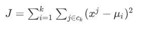

# K-Means

> k聚类算法 未完待续

### 算法原理

Kmeans算法的原理就像是反复移动聚类中心点（一开始随机选取），将类的中心点移动到成员的平均位置（也就是该点到某一类的平均距离最小。

------------------------

### 算法步骤

1. 随机选取k个点作为质心。
2. 对于样本中的每一个点，分别求其与**k点**的距离，距离小的点就属于该类（class k）。
3. 此时对得到的k类分别重新计算一次质心。
4. [结束条件] 当新计算出的质心与原质心的误差小于一个阈值时，算法终止。

--------------------

​						**KMeans代价函数** 	 

