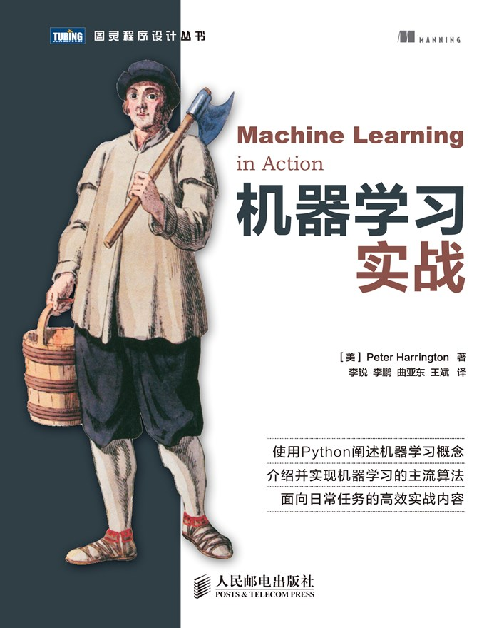

# Python-Data-Analysis
一些Python数据分析、机器学习的demo和经验总结    

demo大部分基于[《机器学习实战》](<https://www.ituring.com.cn/book/1021>)这本书

--------------------------------------------------------------------

| 算法                                                         |            | demo                                                         |      |
| :----------------------------------------------------------- | ---------- | ------------------------------------------------------------ | ---- |
| [kNN](<https://github.com/szupzj18/Python-Data-Analysis/tree/master/kNN>) | k近邻      | [基本实现](<https://github.com/szupzj18/Python-Data-Analysis/blob/master/kNN/kNN%E7%AE%80%E5%8D%95%E5%AE%9E%E7%8E%B0.ipynb>)\|[海伦的约会](<https://github.com/szupzj18/Python-Data-Analysis/blob/master/kNN/%E6%B5%B7%E4%BC%A6%E7%9A%84%E7%BA%A6%E4%BC%9A.ipynb>)\|[手写数字识别](<https://github.com/szupzj18/Python-Data-Analysis/blob/master/kNN/handwriting%20recognition/%E6%95%B0%E5%AD%97%E8%AF%86%E5%88%AB.ipynb>) | ✔    |
| [Decision Tree](<https://github.com/szupzj18/Python-Data-Analysis/tree/master/LM%20and%20DecisionTree>) | 决策树     | [基本实现](<https://github.com/szupzj18/Python-Data-Analysis/blob/master/LM%20and%20DecisionTree/code.ipynb>) | ✔    |
| AdaBoost                                                     | 自适应增强 |                                                              |      |
| Navie Bayes                                                  | 朴素贝叶斯 |                                                              |      |
| Logistic                                                     | 逻辑回归   |                                                              |      |
| SVM                                                          | 支持向量机 |                                                              |      |
| Python可视化                                                 | 各种画图   | 数据导入\|预处理\|绘图                                       |      |
| KMeans                                                       | k聚类      | 代码实现\|[航空公司客户价值分析](<https://github.com/szupzj18/Python-Data-Analysis/blob/master/KMeans/%E8%81%9A%E7%B1%BB%E5%88%86%E6%9E%90%E5%AE%9E%E9%AA%8C.ipynb>) |      |

目前：

- [x]  [LM模型和决策树的小demo](<https://github.com/szupzj18/Python-Data-Analysis/blob/master/LM%20and%20DecisionTree/code.ipynb>) in [LM and Decision Tree] 文件夹（包含EXCEL数据和模型结构）  

- [x] kNN - demo：[海伦的约会](<https://github.com/szupzj18/Python-Data-Analysis/blob/master/kNN/kNN%E7%AE%80%E5%8D%95%E5%AE%9E%E7%8E%B0.ipynb>) 数据+代码+测试
- [x] kNN [手写数字识别](<https://github.com/szupzj18/Python-Data-Analysis/blob/master/kNN/handwriting%20recognition/%E6%95%B0%E5%AD%97%E8%AF%86%E5%88%AB.ipynb>)（数据+代码）
- [ ] K聚类 - demo：[航空公司客户价值分析](<https://github.com/szupzj18/Python-Data-Analysis/blob/master/kNN/%E8%81%9A%E7%B1%BB%E5%88%86%E6%9E%90%E5%AE%9E%E9%AA%8C.ipynb>) demo中算法使用sklearn库实现
- [ ] K聚类 - demo：手写代码实现
- [ ] Python数据可视化：基于[Matplotlib官方网站](<https://matplotlib.org/index.html>)的一些小demo，用于练习Python数据可视化

--------------------------------

ps: 神经网络的模型结构的保存文件 (.keras格式) 推荐使用[Netron](<https://github.com/lutzroeder/netron>)可视化工具

-------

**update log:**

2020.05.13

更新demo：k聚类 航空公司客户价值分析

2020.05.10

更新demo：kNN数字识别代码

2020.05.09  

更新demo：海伦的约会 测试代码  

2020.05.05  

更新了书本上kNN的简单实现（我的版本和教程版本）  

更新“海伦的约会”demo+数据（txt格式） 

